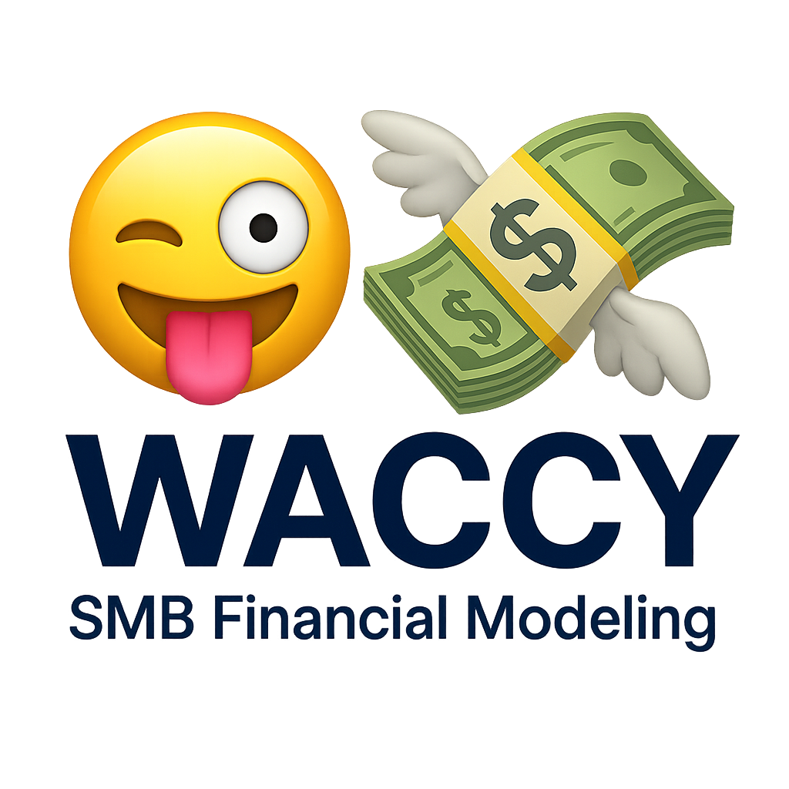

# WACCY

**Intelligent Financial Modeling Platform for Small Businesses**

[](https://opensource.org/licenses/MIT)
[](https://www.python.org/downloads/)
[](https://github.com/astral-sh/ruff)

<div align="center">
  
</div>

WACCY is an intelligent financial modeling platform designed to automatically extract, parse, classify, and synthesize business data from diverse sources to generate sophisticated, production-grade financial models and operating analyses. **The platform's primary focus is on small businesses—from sole proprietorships to growing companies—that struggle with messy, incomplete, and poorly-maintained financial records.**

Unlike large enterprises with dedicated accounting teams, small businesses often have inconsistent record-keeping, ambiguous account classifications, incomplete data, and limited financial infrastructure. WACCY transforms this raw, often chaotic business data into comprehensive, auditable, and decision-ready financial models that adhere to institutional-quality standards.

## 🚀 Quick Start

### Installation

WACCY uses `uv`, the modern Python package manager. Install the core platform:

```bash
# Install uv if you haven't already
curl -LsSf https://astral.sh/uv/install.sh | sh

# Install WACCY core platform
uv pip install waccy

# Install with core extensions (QuickBooks Online and SEC EDGAR)
uv pip install "waccy[quickbooks,edgar]"

# Or install individual extensions
uv pip install waccy-quickbooks
uv pip install waccy-edgar
```

### Basic Usage

```python
from waccy.extraction import ExtractorRegistry
from waccy.modeling import ModelBuilder

# Discover available extractors
registry = ExtractorRegistry()
available_sources = registry.list_extractors()
print(f"Available data sources: {available_sources}")

# Extract data from QuickBooks Online
quickbooks_extractor = registry.get_extractor("quickbooks")
extracted_data = quickbooks_extractor().extract({
    "company_id": "your_company_id",
    "date_range": ("2023-01-01", "2024-12-31")
})

# Build a 3-statement financial model
builder = ModelBuilder()
model = builder.build_three_statement_model(
    extracted_data=extracted_data,
    forecast_periods=12
)

# Export to Google Sheets
builder.export_to_sheets(model, output_path="financial_model.xlsx")
```

## 📋 Core Features

### 🤖 **AI-Powered Data Extraction & Classification**

* **Intelligent Account Mapping**: LLM-enhanced classification for ambiguous account names and inconsistent categorizations
* **Missing Data Inference**: Patterns learned from high-quality sources (EDGAR filings) to infer missing information
* **Causal Chain Recognition**: Understands how financial events cascade through statements
* **Terminology Normalization**: Maps equivalent concepts across different naming conventions
* **Confidence Scoring**: Every classification includes a confidence score for quality assessment

### 🏗️ **Standardized Financial Ontology**

* **WACCY Standard Chart of Accounts**: Comprehensive, standardized classification ontology
* **Universal Mapping**: All data sources map to the same standard accounts for consistency
* **Industry Templates**: Pre-configured extensions for SaaS, manufacturing, retail, real estate, and more
* **Quality Quantification**: Standardized ontology enables measurement of data quality and model reliability

### 📊 **Institutional-Quality Financial Models**

* **3-Statement Integrated Models**: Income statement, balance sheet, and cash flow with full balancing
* **DCF Valuation Models**: Detailed free cash flow construction, terminal value analysis, WACC calculation
* **Trading Comparables**: Peer company analysis with multiple calculation and benchmarking
* **Transaction Comparables**: Precedent M&A transaction analysis
* **LBO Models**: Leveraged buyout analysis with returns calculation and debt schedules
* **M&A Models**: Accretion/dilution analysis with purchase accounting
* **Specialized Models**: SaaS cohort models, REIT models, project finance, cap tables, and more

### 🔌 **Modular Extension Architecture**

* **Core Platform**: Focused core with QuickBooks Online and SEC EDGAR as primary data sources
* **Extensible Design**: Community-developed extension packages for additional data sources
* **Entry Point Discovery**: Automatic discovery of extensions via Python entry points
* **Simple Installation**: Install only the extensions you need

### 📈 **Advanced Forecasting & Analysis**

* **Driver-Based Forecasting**: Revenue builds from price × volume, units × ARPU, cohort models
* **Working Capital Modeling**: DSO, DIO, DPO analysis with seasonality adjustments
* **Debt & Interest Modeling**: Revolver mechanics, amortization schedules, cash sweep waterfalls
* **Tax Modeling**: Effective tax rates, DTAs/DTLs, NOL utilization tracking
* **Sensitivity Analysis**: Comprehensive scenario modeling and tornado charts

### ✅ **Data Quality & Validation**

* **Pandera Validation**: Schema-based validation for extracted data
* **Mapping Confidence Scores**: Quantify the reliability of account mappings
* **Reconciliation Checks**: Cross-referencing between sources and balance checks
* **Audit Trails**: Every data point traceable to source with full provenance

### 📝 **Professional Model Outputs**

* **Google Sheets Export**: Production-ready spreadsheet models with proper formatting
* **Professional Architecture**: Modular tab structures, consistent time axis, clear sign conventions
* **Color Conventions**: Inputs in blue, calculations in black, outputs in green
* **Balance Checks**: Built-in reconciliation tables and error flags
* **Scenario Tooling**: Data tables for sensitivity analysis, scenario toggles, goal seek integration

## 🔄 Complete Workflow

```python
from waccy.extraction import ExtractorRegistry
from waccy.classification import ClassificationEngine
from waccy.modeling import ModelBuilder
from waccy.core.ontology import StandardChartOfAccounts

# 1. Extract data from QuickBooks Online (handles messy, incomplete records)
registry = ExtractorRegistry()
extractor = registry.get_extractor("quickbooks")()
credentials = {
    "client_id": "your_client_id",
    "client_secret": "your_client_secret",
    "access_token": "your_access_token"
}
extractor.authenticate(credentials)

extracted_data = extractor.extract({
    "company_id": "123456789",
    "date_range": ("2022-01-01", "2024-12-31"),
    "include_transactions": True
})

# 2. Classify and map to standard accounts (with LLM enhancement for ambiguity)
ontology = StandardChartOfAccounts()
classification_engine = ClassificationEngine()

for account in extracted_data.accounts:
    mapped_account, confidence = classification_engine.classify_account(
        source_account_name=account.name,
        transaction_patterns=account.transaction_history,
        context={"company_type": "SaaS", "industry": "Software"}
    )
    print(f"Mapped '{account.name}' to '{mapped_account.name}' (confidence: {confidence:.2f})")

# 3. Build 3-statement integrated model
builder = ModelBuilder()
model = builder.build_three_statement_model(
    extracted_data=extracted_data,
    forecast_periods=24
)

# 4. Generate DCF valuation
dcf_model = builder.build_dcf_model(
    three_statement_model=model,
    wacc=0.10,
    terminal_growth_rate=0.03,
    exit_multiple=12.0
)

# 5. Export to Google Sheets
builder.export_to_sheets(model, output_path="financial_model.xlsx")
builder.export_to_sheets(dcf_model, output_path="dcf_valuation.xlsx")

# 6. Generate quality report
quality_report = extracted_data.generate_quality_report()
print(f"Data completeness: {quality_report.completeness:.2%}")
print(f"Average mapping confidence: {quality_report.avg_confidence:.2f}")
print(f"Issues flagged: {len(quality_report.issues)}")
```

## 📊 Example Output

### Standardized Account Mapping

**Source Account**: `"Sales Revenue"` (QuickBooks)  
**Mapped To**: `Revenue - Product Sales` (WACCY Standard)  
**Confidence**: 0.95  
**Validation**: ✅ Transaction patterns match revenue recognition

### 3-Statement Model Structure

```
Financial Model.xlsx
├── Assumptions
│   ├── Revenue Drivers
│   ├── Cost Assumptions
│   └── Working Capital
├── Income Statement
│   ├── Historical (3 years)
│   └── Forecast (2 years)
├── Balance Sheet
│   ├── Assets (Current & Non-Current)
│   ├── Liabilities (Current & Non-Current)
│   └── Equity
├── Cash Flow Statement
│   ├── Operating Activities
│   ├── Investing Activities
│   └── Financing Activities
├── Supporting Schedules
│   ├── Working Capital Detail
│   ├── Debt Schedule
│   └── Depreciation
└── Checks & Reconciliations
    ├── Balance Checks
    └── Quality Metrics
```

## 🔗 Core Data Sources

### QuickBooks Online (QBO)

**Primary Data Source** - The accounting system most commonly used by small businesses.

* Direct API integration for chart of accounts, general ledger, and financial statements
* Intelligent handling of ambiguous, inconsistently-named accounts
* Transaction-level detail extraction
* Vendor and customer data integration
* Skeptical treatment of source classifications with validation

### SEC EDGAR

**Pattern Learning & Reference Data** - High-quality financial data for learning and benchmarking.

* Automated parsing of 10-K, 10-Q, 8-K filings
* Proxy statement and registration statement processing
* Pattern extraction for proper financial classification
* Learning causal chains from professional financial reports
* Application of learned patterns to small business data

### Extension Packages

Additional data sources available as modular extensions:

* `waccy-google` - Google Drive and Gmail integration
* `waccy-xero` - Xero accounting system
* `waccy-sage` - Sage accounting platform
* `waccy-stripe` - Payment processor data
* `waccy-salesforce` - CRM and sales pipeline data

## 📁 Project Structure

```
waccy/
├── src/
│   └── waccy/
│       ├── core/
│       │   ├── ontology.py          # Standardized chart of accounts
│       │   ├── models.py            # Core data models (Pydantic)
│       │   └── validation.py        # Data validation (Pandera)
│       ├── extraction/
│       │   ├── base.py              # Abstract base classes
│       │   ├── registry.py          # Extension registry
│       │   └── mapper.py            # Mapping to standard ontology
│       ├── classification/
│       │   ├── engine.py            # LLM-enhanced classification
│       │   ├── patterns.py          # Pattern matching from EDGAR
│       │   └── confidence.py        # Confidence scoring
│       ├── modeling/
│       │   ├── builder.py           # Model construction
│       │   ├── templates.py         # Model templates
│       │   └── exporters.py         # Google Sheets export
│       └── utils/
│           ├── dates.py
│           ├── formatting.py
│           └── validation.py
├── tests/
│   ├── unit/
│   ├── integration/
│   └── fixtures/
├── docs/
│   ├── 0-MISSION.md
│   ├── 1-ARCHITECTURE.md
│   ├── 2-EXPERIENCE.md
│   └── skills_models.md
└── pyproject.toml
```

## 🧪 Testing

```bash
# Install development dependencies
uv sync --dev

# Run all tests
uv run pytest

# Run with coverage
uv run pytest --cov=waccy --cov-report=html

# Run specific test suites
uv run pytest tests/unit/
uv run pytest tests/integration/

# Format and lint with ruff
uv run ruff format
uv run ruff check --fix

# Type checking with mypy
uv run mypy src/waccy
```

## 📚 Documentation

* **[Mission Statement](docs/0-MISSION.md)** - Project goals, philosophy, and roadmap
* **[Architecture](docs/1-ARCHITECTURE.md)** - Technical architecture and design principles
* **[Experience Guide](docs/2-EXPERIENCE.md)** - User experience and workflows
* **[Skills & Models](docs/skills_models.md)** - Financial modeling capabilities

## 🏛️ Design Principles

1. **Simplicity and Focus**: Core platform maintains a simple, focused design with essential data sources (QBO and EDGAR)

2. **Standardized Ontology First**: All financial data maps to a standardized WACCY chart of accounts, ensuring consistency and comparability

3. **Modular Extensibility**: New data sources and model types added as separate packages that conform to core interfaces

4. **Accuracy First**: Deterministic functions preferred over probabilistic models. LLMs used for parsing and classification, not financial calculations

5. **Transparency and Auditability**: Every data point traceable to source, every calculation explainable, every assumption documented

6. **Professional Standards**: Models adhere to institutional-quality standards for architecture, formatting, and presentation

7. **Quality Quantification**: Standardized ontology enables measurement and reporting of data quality and model output reliability

8. **Small Business Focus**: Designed primarily for small businesses—from sole proprietorships to growing companies—handling messy, incomplete data

## 🤝 Contributing

We welcome contributions! WACCY is built for the small business community, and we'd love your help making financial modeling more accessible.

### Getting Started

1. **Fork the repository** on GitHub
2. **Create a feature branch** for your contribution
3. **Set up development environment**:
   ```bash
   git clone https://github.com/your-username/waccy.git
   cd waccy
   uv sync --dev
   ```
4. **Make your changes** following our coding standards:
   - Use `ruff` for formatting and linting
   - Add type hints with `mypy` compliance
   - Write tests for new functionality
   - Update documentation as needed
5. **Run tests and linting**:
   ```bash
   uv run pytest
   uv run ruff check
   uv run mypy src/
   ```
6. **Submit a pull request** with a clear description of your changes

### Creating Extensions

Want to add a new data source? Create an extension package:

1. Create a new package: `waccy-yourdatasource`
2. Implement the `Extractor` interface from `waccy.extraction.base`
3. Register your extension via entry points
4. Follow the [Extension Development Guide](docs/1-ARCHITECTURE.md#extension-development-guide)

See our [Architecture Documentation](docs/1-ARCHITECTURE.md) for detailed extension development guidelines.

### Code of Conduct

Please read and follow our [Code of Conduct](CODE_OF_CONDUCT.md) to ensure a welcoming environment for all contributors.

## 📈 Project Status

* **Phase 1**: 📋 Planned - Core foundation and 3-statement models
* **Phase 2**: 📋 Planned - Public market data and pattern learning (EDGAR)
* **Phase 3**: 📋 Planned - Advanced valuation models (DCF, M&A, LBO)
* **Phase 4**: 📋 Planned - Specialized model types (SaaS, REIT, project finance)
* **Phase 5**: 📋 Planned - Advanced analysis and decision support

**Current Status**: Early development - Architecture and core platform design  
**Python Version**: 3.13+  
**Package Manager**: [uv](https://github.com/astral-sh/uv)  
**CI/CD**: GitHub Actions (coming soon)

## 📄 License

This project is licensed under the MIT License - see the [LICENSE](LICENSE) file for details.

## 🙏 Acknowledgments

* **Small Business Community** - Built for entrepreneurs and small business owners who need professional financial modeling
* **Financial Modeling Community** - Inspired by institutional-quality modeling standards
* **Open Source Tools**: 
  * [uv](https://github.com/astral-sh/uv) - Modern Python package manager
  * [ruff](https://github.com/astral-sh/ruff) - Fast Python linter and formatter
  * [Pydantic](https://github.com/pydantic/pydantic) - Data validation framework
  * [Polars](https://github.com/pola-rs/polars) - High-performance data manipulation
  * [Pandera](https://github.com/pandera-dev/pandera) - Statistical data validation

---

**Made with 🤪 for small businesses that deserve institutional-quality financial modeling**
